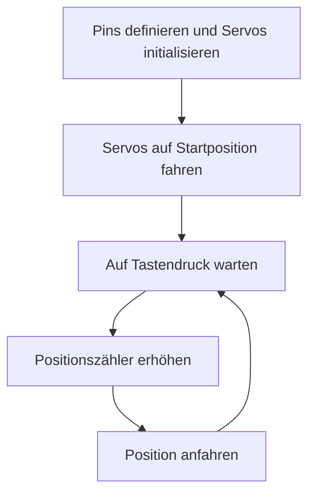

# Passive Steuerung

## Beschreibung

Zu Beginn verbindet der Arduino beide Servos. Danach fährt der Servo die Startposition an. Dann wartet er auf einen Tastendruck und fährt eine der vordefinierten Positionen an. Dieser Vorgang wiederholt sich fortlaufend, solange die Konstruktion Strom hat

## Programmablaufplan

