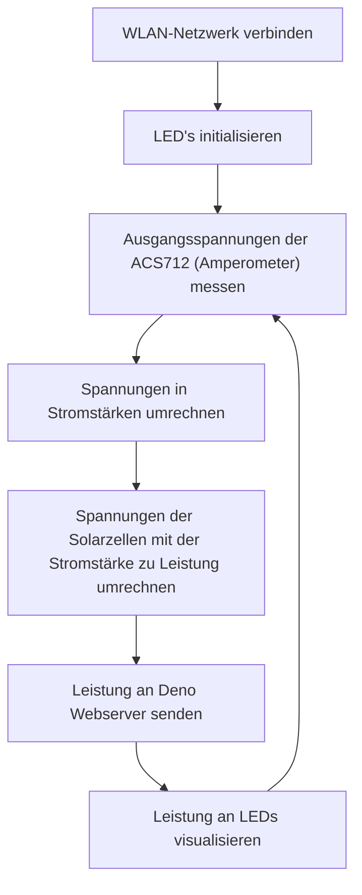

# Leistungserfassung

## Beschreibung

Zu aller Erst verbindet sich der ESP32 mit dem WLAN-Netzwerk. Mithilfe eines ACS712 werden die Stromstärken der Solarzellen gemessen und an einen Deno Webserver übertragen. Über den Webserver können diese Daten dann ausgelesen und angezeigt werden. Zudem visualisiert der ESP die Stromstärke an zwei LEDs

## Programmablaufplan

